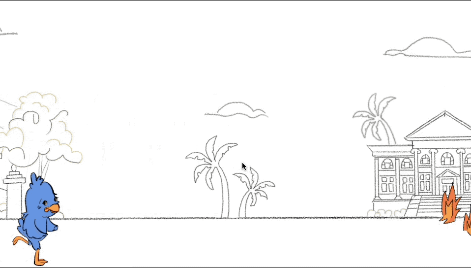

# Sagehen-Sprint

I am currently teaching myself CSS/ HTML5/ Javascript. After finishing my first course in CS in the Spring '21 semester, I realized that I wanted to implement my drawings with some computer code! My goal is to create a simple game using my design of Pomona College's mascot, Cecil the Sagehen. 

# Original Sticker Design

# Evolution of Project
Since my first language is Python, I tried to use the Pygame extension to create the game. I hoped to learn more object-oriented programming with Python through using Pygame. However, I realized that I would like this game to be more accessable to Pomona Students and Sagehen Fans and switched the implementation of the project to HTML/ CSS/ and Javascript. I had done some (*very*) simple websites with HTML/ CSS/ and Javascript, but this project has allowed me to explore the extensive styling elements of CSS and more about Javascript's syntax. 
# Version 3 (Sept 27- Oct 4th 2021)

- created start page & designed original background on procreate
- unsuccessfuly tried to:
    - implement a game over screen (trying to learn more about appendChild/removeChild on JavaScript)
    - attempted to deploy website on Cloudflare pages (formatting is incorrect)
    - goal for next version: fix the techincal problems outlined above
    
# Version 2 (Sept 19-26th 2021)

- used Javascript to:
    - allow Cecil to jump with user pressing spacebar
    - deploy obstacles (fires) at random times
    - enable the simple game logic (when Cecil fails to jump over the fire = game over)
- created better gif through looking at the frame pause/rate and adjusting from 80ms/ frame to 20-30ms/frame

## goal for next version
- create a main game screen & game over screen
- fix jump pattern & deploy obstacles at higher rate
- deploy as a website

### other longterm goals
- add a leaderboard
- add a game over animation
- color background? (I like the simplicity of the background as it is)

# Version 1 (Sept 11-18th 2021)

- used CSS to style Cecil the Sagehen
- used animate feature on CSS to coordinate Cecil's walk & scrolling background
- added multiple classes for Cecil, the fire obstacle, and background from the CSS file to the HTML 

## goal for next version
- add color to Cecil, jump feature, more versions/variation of fire obstacles & background
  - improve the playback of the game animation on github
  - gifs are hard! this gif is much slower than the current animation on the style.css file

